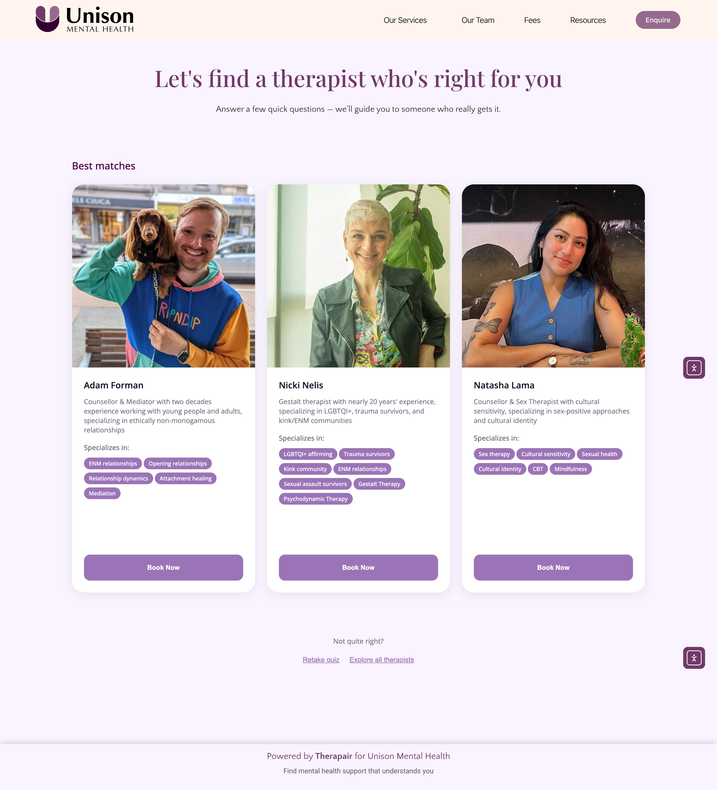

# Therapair Screenshot Capture Guide

**Purpose**: Capture clean screenshots of just the Therapair widget content (iframe only) - no browser window, no Unison branding

---

## 🎯 Objectives

1. **Clean Iframe Content Only**: Capture just the quiz interface and result cards
2. **No Browser Window**: No browser chrome, address bar, or external branding
3. **Show 3 Result Cards**: All 3 therapist recommendations fully visible
4. **Full Card Visibility**: From profile picture at top to CTA buttons at bottom
5. **Reduce White Space**: Less spacing between skills pills and "Book Now" button

---

## 📋 Prerequisites

```bash
# Install Playwright (if not already installed)
npm install -D @playwright/test

# Install browsers
npx playwright install
```

---

## 🚀 Method 1: Clean Iframe Capture with Playwright (Recommended)

### Step 1: Capture Clean Quiz Question

```bash
cd /Users/tino/Projects/therapair-landing-page

# Capture just the iframe content (quiz question)
npx playwright test tests/capture-results-screenshots.spec.js -g "capture clean iframe content - quiz question"
```

**Result**: Clean quiz question screenshot with no browser window or Unison branding

### Step 2: Capture Clean Results Cards

```bash
# Capture results cards from iframe
npx playwright test tests/capture-results-screenshots.spec.js -g "capture clean iframe content - results cards" --debug
```

**What happens**:
1. Playwright opens browser and finds the Therapair iframe
2. Injects CSS to reduce white space between elements
3. Pauses for manual navigation through quiz
4. Once at results page, capture just the iframe content

### Step 3: Manual Navigation & Screenshot

1. **Complete the quiz** in the paused browser window
2. **Reach results page** with 3 therapist cards
3. **Run screenshot command** in Playwright Inspector console:
   ```javascript
   await iframe.locator(".typebot-container").screenshot({ 
     path: "images/therapair-results-3-cards.png",
     padding: 8
   })
   ```

**Result**: Clean 3-card results screenshot with no external branding

---

## 🖥️ Method 2: Manual Browser Capture with DevTools

### Step 1: Open browser with proper viewport

```bash
# Chrome with specific viewport
/Applications/Google\ Chrome.app/Contents/MacOS/Google\ Chrome \
  --window-size=1600,2400 \
  https://unisonmentalhealth.com/find-a-therapist-who-is-right-for-you/
```

### Step 2: Adjust styling (Optional - reduce white space)

1. Open DevTools (F12 or Cmd+Option+I)
2. Go to Console tab
3. Paste this CSS injection:

```javascript
// Inject CSS to reduce white space
const style = document.createElement('style');
style.innerHTML = `
  /* Reduce spacing between skills and button */
  [class*="skill"], [class*="pill"], [class*="tag"] {
    margin-bottom: 0.5rem !important;
  }
  [class*="button-container"], [class*="cta"], button[class*="book"] {
    margin-top: 1rem !important;
    padding-top: 0.5rem !important;
  }
  /* Compact card layout */
  [class*="card"] > * {
    margin-bottom: 0.75rem !important;
  }
`;
document.head.appendChild(style);
console.log('✅ Spacing adjusted');
```

### Step 3: Navigate through quiz

1. Complete the Therapair matching quiz
2. Answer questions to reach results page
3. Ensure 3 therapist cards are displayed
4. Scroll/adjust viewport so all 3 cards are fully visible
   - **Top**: Profile picture visible
   - **Bottom**: "Book Now" or CTA buttons visible

### Step 4: Capture screenshots

**Option A: DevTools Screenshot (Full precision)**
1. Open DevTools (F12)
2. Press Cmd+Shift+P (Mac) or Ctrl+Shift+P (Windows)
3. Type "Capture screenshot"
4. Choose "Capture screenshot" (not full size)
5. Save as `therapair-results-3-cards.png`

**Option B: Built-in macOS Screenshot**
1. Press Cmd+Shift+4
2. Press Spacebar (captures full window)
3. Click on browser window
4. Save and rename to `therapair-results-3-cards.png`

---

## 📐 Viewport Specifications

### Recommended Viewports

**For Full Card Visibility**:
- Width: 1600px (shows cards comfortably)
- Height: 2400px (tall enough for 3 full cards vertically)

**For Quiz Question**:
- Width: 1920px (standard desktop)
- Height: 1400px (enough for question + context)

### Setting Viewport in Playwright

```javascript
await page.setViewportSize({ width: 1600, height: 2400 });
```

### Setting Viewport in Chrome DevTools

1. Open DevTools (F12)
2. Toggle Device Toolbar (Cmd+Shift+M)
3. Select "Responsive"
4. Enter dimensions: 1600 x 2400
5. Set DPR (Device Pixel Ratio): 1 or 2 for Retina

---

## 🎨 CSS Adjustments for Better Spacing

### Target Elements

Depending on the Unison widget structure, target these:

```css
/* Skills/Pills spacing */
[class*="skill"],
[class*="pill"],
[class*="tag"],
.skill-tag,
.specialization {
  margin-bottom: 0.5rem !important;
  margin-right: 0.5rem !important;
}

/* Button container spacing */
[class*="button"],
[class*="cta"],
.book-now,
[class*="action"] {
  margin-top: 1rem !important;
  padding-top: 0.5rem !important;
}

/* Card internal spacing */
[class*="card"] > * {
  margin-bottom: 0.75rem !important;
}

/* Reduce card padding if too spacious */
[class*="card"] {
  padding: 1.5rem !important;
}
```

### Apply CSS in Browser Console

```javascript
// Quick CSS injection
document.querySelector('body').insertAdjacentHTML('beforeend', `
  <style id="therapair-spacing-fix">
    [class*="skill"], [class*="pill"] { margin-bottom: 0.5rem !important; }
    [class*="button-container"] { margin-top: 1rem !important; }
  </style>
`);
```

---

## 📸 Screenshot Checklist

Before capturing, verify:

- [ ] **3 Cards Visible**: All three therapist recommendations showing
- [ ] **Full Cards**: 
  - Top: Profile picture fully visible
  - Middle: Name, credentials, specializations visible
  - Bottom: Skills pills and "Book Now" button fully visible
- [ ] **Reduced White Space**: Spacing between elements looks compact
- [ ] **Good Quality**: Image is crisp, not blurry
- [ ] **Appropriate Scale**: Cards are readable but fit in viewport
- [ ] **No Cut-off**: No cards are partially hidden or cropped

---

## 📁 File Naming & Location

### Save screenshots to:

```
/Users/tino/Projects/therapair-landing-page/images/
```

### File names:

1. **Quiz Question View**:
   - `therapair-quiz-question.png` (already exists, update if needed)

2. **Results View (3 Cards)**:
   - `therapair-results-3-cards.png` (NEW)
   - Or update existing: `therapair-results-full.png`

---

## 🔄 Updating the Landing Page

### After capturing new screenshots:

1. **Copy to images folder**:
   ```bash
   cp ~/Downloads/therapair-results-3-cards.png \
      /Users/tino/Projects/therapair-landing-page/images/
   ```

2. **Update index.html** (if changing filename):
   ```html
   <!-- Find line ~356 -->
   
   ```

3. **Test locally**:
   ```bash
   open /Users/tino/Projects/therapair-landing-page/index.html
   ```

4. **Commit and deploy**:
   ```bash
   git add images/therapair-results-3-cards.png index.html
   git commit -m "Update results screenshot to show 3 full cards"
   git push github main
   ./deploy-to-hostinger.sh
   ```

---

## 🎯 Specific Requirements from Feedback

### ✅ 3 Result Cards
- Show all 3 therapist recommendations
- No scrolling needed to see all cards

### ✅ Fully Visible Cards
- **Top**: Profile picture completely visible
- **Middle**: Name, title, credentials, bio excerpt
- **Bottom**: Skills pills AND "Book Now" button fully visible

### ✅ Reduced White Space in Unison Widget
- Less space between skills pills and "Book Now" button
- Use CSS injection (see CSS Adjustments section above)

### ✅ Thank You Page Link
- ✅ Already updated: "Therapair" now links to therapair.com.au
- Opens in new window (target="_blank")

### ✅ Playwright Browser Window
- Set viewport to show content smaller (1600x2400)
- Captures full cards without manual scrolling

---

## 🛠️ Troubleshooting

### Issue: Cards are cut off

**Solution**: Increase viewport height
```javascript
await page.setViewportSize({ width: 1600, height: 3000 }); // Even taller
```

### Issue: Can't find result cards selector

**Solution**: Use Playwright Inspector to identify elements
```bash
npx playwright test --debug
# Then use Pick Locator tool
```

### Issue: CSS not applying

**Solution**: Add !important and check iframe context
```javascript
// If widget is in iframe
const frames = page.frames();
for (const frame of frames) {
  await frame.addStyleTag({ content: '...' });
}
```

### Issue: White space still too large

**Solution**: Target more specific selectors
```javascript
// Inspect element in DevTools to find exact class names
// Then adjust CSS more precisely
```

---

## 🎬 Quick Start Command

```bash
# One-command solution
cd /Users/tino/Projects/therapair-landing-page && \
npx playwright test tests/capture-results-screenshots.spec.js:36 --debug

# This opens: "pause for manual navigation and screenshot" test
# Navigate manually, then screenshot when ready
```

---

## 📊 Expected Results

### Quiz Question Screenshot
- **Dimensions**: ~1920x1080 (landscape)
- **Content**: One question card with multiple choice options
- **Quality**: High-res, crisp text

### Results Screenshot (3 Cards)
- **Dimensions**: ~1600x2400 (portrait/tall)
- **Content**: 3 therapist profile cards stacked vertically
- **Visibility**: All cards fully visible (top to bottom)
- **Spacing**: Compact, professional spacing

---

## ✅ Final Checklist

- [ ] Playwright installed and browsers ready
- [ ] Viewport size set appropriately (1600x2400)
- [ ] CSS injected to reduce white space
- [ ] Quiz completed to reach results page
- [ ] 3 cards fully visible on screen
- [ ] Screenshot captured and saved
- [ ] File copied to `/images/` folder
- [ ] Landing page updated (if needed)
- [ ] Changes committed and deployed
- [ ] Thank you page "Therapair" link verified

---

## 📞 Questions or Issues?

If you encounter issues:

1. Check browser console for errors
2. Verify Unison widget URL is current
3. Inspect widget structure in DevTools
4. Adjust CSS selectors based on actual HTML
5. Use Playwright Inspector for debugging

---

**Last Updated**: 13 October 2025  
**Status**: Ready for screenshot capture

**Next Step**: Run `npx playwright test tests/capture-results-screenshots.spec.js --debug`

